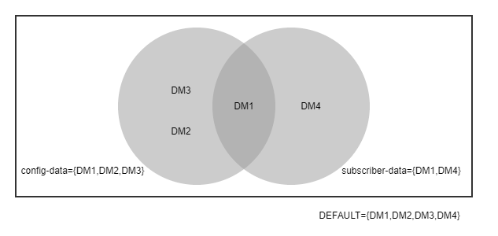

# Table of Contents

[TOC]

# ADP Backup and Restore

# Backup and Restore Solution Environment View
---

The ADP backup and restore solution is designed to allow for the backup of a Cloud Native Function(CNF) or a Cloud Native Application(CNA) as part of a cloud native deployment.
A single clound native deployment will contain many CNFs and CNAs to support the delevery and management of a cloud native mobile network.

The example below shows a cloud native enviornment based on a kubernetes environment with several CNFs and CNAs running as independent namespaces in the environment.

It is the stateful data within these CNFs and CNAs that the ADP backup and restore solution targets.

To allow for a backup to be taken of a CNF or CNA there are two APIs of interest. The first allows for the relevant backup and restore commands to be sent to the CNF or CNA.
The second allows for a backup to be imported and exported into and out of the CNF/CNA.

These endpoints are served in different ways depending on weather the solution is used within a CNF or a CNA. As all CNFs will support NETCONF the backup and restore operations can be accessed in this way for CNFs.
Note that only the main services of interest for this discussion are show in the example below.

In the case  of the CNAs the backup and restore functionalty can be accessed by accessing the relevant function in the CNA or by the CNA exposing the Backup and Restore Orchestrator via an authorization proxy.
In the example below an Authorization and Authentication Proxy is used.

---
**NOTE**

In the CNF and CNA examples above it should be noted that a CNF may contain an Authorization and Authentacation Proxy and that a CNA may contain Configuration Management to fulfil other functions. The intention here
is to show the recommended generic services to be inculded in a CNF or CNA for the purpose of backup and restore.

---

 

# Backup and Restore Solution Building Blocks

The backup and restore solution is formed through the interaction of several services.

1. Backup and Restore Orchestrator
    * provides a central place to control the execution of Bacup and Restore Operations along with support funcions for same.
2. Data Management Service(s)
    * Provides a particular type of state storage, graph, document, object, messages to allow for optimized data storage and retrieval per use case.
3. Backup and Restore Agent
    * Provides a commmon backup and restore interface to allow for central management of backup and restore actions on data management services.

Each of these services works together to create a backup or perform the restoration of a CNF/CNA.

---

 

# Features
---

The backup and restore solution supports a number of features and can be configured to support the needs of the CNF/CNA.

## Backup

Basic functionality which will create a data set which will allow for the restoration of a CNF/CNA

| Services Involved                | Used For                                                                                                      |
|----------------------------------|:-------------------------------------------------------------------------------------------------------------:|
| Backup and Restore Orchestrator  | To receive the backup request and involve the relevant data management services to create the backup requested |
| Backup and Restore Agent(s)      | To receive the request and collect the requested data from its associated data managemnt service and transmit it to the BRO |

## Restore

Basic functionality which will allow for the restoration of a CNF/CNA to a previous state

| Services Involved                | Used For                                                                                                      |
|----------------------------------|:-------------------------------------------------------------------------------------------------------------:|
| Backup and Restore Orchestrator  | To receive the backup request and involve the relevant data management services to create the backup requested |
| Backup and Restore Agent(s)      | To receive the request and collect the requested data from its associated data managemnt service and transmit it to the BRO |

## Import

Basic functionality which will import a data set into a CNF/CNA so it can be used for restoration of same

| Services Involved                | Used For                                                                                                      |
|----------------------------------|:-------------------------------------------------------------------------------------------------------------:|
| Backup and Restore Orchestrator  | To receive the import request and transfer the backup via SFTP to the specified target |

## Export

Basic functionality which will export a data set out of a CNF/CNA so it can be archived

| Services Involved                | Used For                                                                                                      |
|----------------------------------|:-------------------------------------------------------------------------------------------------------------:|
| Backup and Restore Orchestrator  | To receive the Export request and retrive the backup via SFTP from the specified target |

## Housekeeping

Basic functionality which will delte a backup in order to allow for new backups or improts to occour, enabled by default can be disabled if required.

| Services Involved                | Used For                                                                                                      |
|----------------------------------|:-------------------------------------------------------------------------------------------------------------:|
| Backup and Restore Orchestrator  | Receives the Housekeeping configuration and acts on it upon a Backup or Import request |

## Backup Manager (Optional)

Optional functionality which defines a data set to be included in a backup. DEFAULT backup manager is always available. Addtional backup managers need to be configured.

| Services Involved                | Used For                                                                                                      |
|----------------------------------|:-------------------------------------------------------------------------------------------------------------:|
| Backup and Restore Orchestrator  | Maintains a list of available backup managers, assigns Backup and Restore Agents to a manager based on backup and restore agent registration information |
| Backup and Restore Agent(s)      | Submits a backup type to BRO to indicate what data set it belongs to  |

## Virtual Backup Manager (Optional)

Optional functionality which defines a data set to be included in a virtual backup manager. Can utilize a subset of the backup taken in an associated backup manager or create a subset of the associated backup manager.

| Services Involved                | Used For                                                                                                      |
|----------------------------------|:-------------------------------------------------------------------------------------------------------------:|
| Backup and Restore Orchestrator  | Maintains a list of available virtual backup managers, assigns Backup and Restore Agents to a manager based on backup and restore agent registration information |
| Backup and Restore Agent(s)      | Submits a backup type and virtual backup type to BRO to indicate what data set it belongs to  |

## Application Product Check (Optional)

Optional functionality which allows the CNF or CNA to reject a restore at the earliest point available if an incompatibility is identified.
This feature uses product number and major version to perform the check.

| Services Involved                | Used For                                                                                                      |
|----------------------------------|:-------------------------------------------------------------------------------------------------------------:|
| Backup and Restore Orchestrator  | Includes CNF or CNA product information in the software list included in each backup |
| ASIH                             | Creates a config map containing the CNF or CNA product information  |
| Kubernetes API server            | Provides access to the application configmap  |

## Semantic Software Version Check (Optional)

Optional functionality which allows the CNF or CNA to reject a restore at the earliest point available if an incompatibility is identified.
This feature uses major, minor, and patch version to perform the check.

| Services Involved                | Used For                                                                                                      |
|----------------------------------|:-------------------------------------------------------------------------------------------------------------:|
| Backup and Restore Orchestrator  | Includes CNF or CNA product information in the software list included in each backup |
| ASIH                             | Creates a config map containing the CNF or CNA product information  |
| Kubernetes API server            | Provides access to the application configmap  |

## Agent Level Version Checks

Functionality which identifies if an agent can handle a given backup based on a semantic version.

| Services Involved                | Used For                                                                                                      |
|----------------------------------|:-------------------------------------------------------------------------------------------------------------:|
| Backup and Restore Orchestrator  | Includes agent product information in the software list included in each backup  |
| Backup and Restore Agent(s)      | Sends product information to BRO on registration and checks the version during restore  |

## Backup and Restore Agent Discovery (Optional)

Functionality which finds all the Agents expected to participate in a backup. If the registered Agents do not match the expected agents, the backup will fail.

| Services Involved                | Used For                                                                                                      |
|----------------------------------|:-------------------------------------------------------------------------------------------------------------:|
| Backup and Restore Orchestrator  | Requests a list of PODs from the kuberneties API server and filters for expected annotations |
| Backup and Restore Agent(s)      | Allows for customazion of the backup types it supports, adds backup types and other metadata annotations to the pod to allow it to be discovered |
| Kubernetes API server            | Source of truth for all available deployments in a namespace  |

## Backup and Restore Notifications (Optional)

Optional Functionality which sends a notification via message bus to indicate that the backup/restore has started, completed or failed.

| Services Involved                | Used For                                                                                                      |
|----------------------------------|:-------------------------------------------------------------------------------------------------------------:|
| Backup and Restore Orchestrator  | Sends the message to the message bus |
| Receiving Service                | Reads the notification from the message bus |
| Message Bus KF                   | Provides sub/pub interfaces for the messageing |
| Key Value Database RD            | Provides sub/pub interfaces for the messageing |

The notifications can be sent via either Message Bus KF or Key Value Database RD, which can be configured in the Backup and Restore Orchestrator.

## Backup and Restore mTLS (optional)

ADP generic functionality which secures communication between services.

| Services Involved                | Used For                                                                                                      |
|----------------------------------|:-------------------------------------------------------------------------------------------------------------:|
| Backup and Restore Orchestrator  | Acts as server for serveral interfaces, requests certs from security stack using custom resources   |
| Security Stack                   | Provides custom resources definations and generates certificates based on requests |

## Backup and Restore Direct Stream Logging (optional)

ADP generic functionality which handles centralized logging. The direct streaming of logs to the logging stack is an optional feature.

| Services Involved                | Used For                                                                                                      |
|----------------------------------|:-------------------------------------------------------------------------------------------------------------:|
| Backup and Restore Orchestrator  | Writes logs to console and TCP socket in logging stack  |
| Logging Stack                    | Provides centralized logging collection for a CNF/CNA |

## Backup and Restore Metrics (optional)

Backup and restore specific metrics are collected centrally in the backup and restore orchestrator. The specific metrics available can be viewed
in the relevant [PM Metrics fragment](https://adpci.sero.wh.rnd.internal.ericsson.com/results/reports/releases/eric-ctrl-bro.html)

| Services Involved                | Used For                                                                                                      |
|----------------------------------|:-------------------------------------------------------------------------------------------------------------:|
| Backup and Restore Orchestrator  | provides metrics on BRO as well as agents |
| PM server                        | Provides centralized logging collection for a CNF/CNA |

 

# Deployments
---

The Backup and restore solution has two recommended deployments which are dictated by the type of solution that is to be implemented: either a CNF or CNA.
These two main areas can be further refined to meet further needs through the inclusion of optional features.

## The Basics
The generic services which provide the functionaly for the full backup and restore solution are listed below:

* Security Stack
    * [LDAP](https://adp.ericsson.se/marketplace/ldap-server)
    * [KMS](https://adp.ericsson.se/marketplace/key-management)
    * [DCED](https://adp.ericsson.se/marketplace/distributed-coordinator-ed)
    * [SIP-TLS](https://adp.ericsson.se/marketplace/service-identity-provider-tls)
    * [SEP](https://adp.ericsson.se/marketplace/storage-encryption-provider)
    * [CERTM](https://adp.ericsson.se/marketplace/certificate-management)
* Logging Stack
    * [Log Transformer](https://adp.ericsson.se/marketplace/log-transformer)
    * [Search Engine](https://adp.ericsson.se/marketplace/search-engine)
* Notifications
    * [Message Bus KF](https://adp.ericsson.se/marketplace/message-bus-kf)
    * [Key Value Database RD](https://adp.ericsson.se/marketplace/key-value-database-rd)
* [Backup and Restore Orchestrator](https://adp.ericsson.se/marketplace/backup-and-restore-orchestrator)
* [Performance Management](https://adp.ericsson.se/marketplace/pm-server)
* [SWIM](https://adp.ericsson.se/marketplace/software-inventory-manager)
* [ASIH](https://adp.ericsson.se/marketplace/application-sys-info-handler)
* Storage
  * Persistent Volume Claims
  * [OSMN](https://adp.ericsson.se/marketplace/object-storage-mn)

## Cloud Native Function (CNF) Deployment
In addition to the already listed generic services a CNF will also need to deploy:

* Configuration Management
    * [CMM](https://adp.ericsson.se/marketplace/cm-mediator)
    * [CMYP](https://adp.ericsson.se/marketplace/cm-yang-provider)
    * [Document Database PG](https://adp.ericsson.se/marketplace/document-database-pg)
* Specific Data Management Services

## Cloud Native Application (CNA) Deployment
In addition to the already listed generic services a CNA will also need to deploy:

* [Authorization and Authentication Proxy](https://adp.ericsson.se/marketplace/rbac-authorization-proxy)
* Specific Data Management Services

Each CNF and CNA will need to consider the storage options available for the persisteance of their state and include the releated generic service. Please consult the [ADP Portal](https://adp.ericsson.se/marketplace/?groupby=reusability_level&serviceArea=1)
to see the available data management services for consideration of inclusion in a CNF/CNA.

## Additional Deployment Considerations
### Storage
Storage of the backups can be done in two ways a PVC or using Object Store.
The PVC provides POSIX file storage accessible within the CNF/CNA. The main areas to consider when using the PVC is the capacity and encryption at rest. Capacity requirements are per CNA/CNF and will need to account for the size and number of backups that
will be created and stored within the CNF/CNA. If sensitive data will be part of a backup then it is recommended to consider providing an encrypted PVC by utilizing [SEP](https://adp.ericsson.se/marketplace/storage-encryption-provider)
The Object Store provides S3 storage compatibility within the CNF/CNA. The main areas to consider when using the Object Store are capacity and access.  
When using the object storage as a backend for backups as well as the capacity considerations for backups the capacity considerations need to also include any recommendations made by the object store provider.
Access to the Object Store also needs to be confirmed (user/routing).

### end-2-end encryption
In flight encryption
* IMPORT -> BRO: SFTP
* BRO -> BRA: TLS/mTLS
* BRA -> Data Management Service: Service specific.

At rest encryption
* SFTP server: external customer specific configuration
* BRO: none provided by default requires configuration of SEP or utilizing the Object Store
* Agent(where used): none provided by default requires configuration of SEP

 

# Solution Configuration
---

In this section the high level end to end configuration of a backup will be discussed.
For configuration of specific features please see the relevant generic services user guide.

The ADP backup and restore solution covers multiple services and requires that they are setup during design time to achive a consistent end to end backup for a CNF or CNA function/feature.

## Including data management services in a backup
 The default settings will allow for the creation of a blanket backup for all data management services in the deployment. The diagram below illustrates this concept, the data management services are all part
 of the set **DEFAULT**. This set is available in the Backup and restore solution as a backup manager with the id of DEFAULT.

If required the applciaton can configure multiple backup types, this requires setting the desired types on the relevant data management services.

In this example we consider that two backup types have been configured **config-data** and **subscriber-data**, there is also a single service **DM1** which belongs to both backup types.
This will result in a bakcup manager of DEFAULT, **config-data** and **subscriber-data** being available for carrying out backup and restore related operations.

In order to realize this configuration it is necessary to specify these backup types on the backup and restore agents associated with the data management services.
The agent associated with **DM1** in this example will also need to support multiple backup types to allow for the configuration of both **config-data** and **subscriber-data**.

## Including specific data from within a data management service

The default settings are for all agents to include all data in a backup, this however may not be suitible for taking a backup of a particular feature/function.
Selective backup is included in the backup and restore solution at design time. The backup types again are used here to fulfil this requirement.
Provided it is supported by the agent associated with the data management service it is possible to supply a configuration to identify what data an aganet should include in an associated backup type.
The defination of this backup type will result in a backup manager being created. No special operations or arguments are required for the user to trigger this kind of backup.

On calling a backp on this backup type the backup and restore orchestrator will send the backup type to the related agents allowing them to perform a lookup of the provided configuration and take the necessary actions to include only the specifed data in the backup.

## Storage requirements

The backup and restore solution leverages storage available within the namespace for backups. The data management services may require a staging area for the fragemnt of a backup that they are working with.
The backup and restore orchestrator stores all backups in local storage, guidance on the proper configuration of storage is available in the relevant user guides for each service.

## Network configuration

No special network configurtion is considered for the backup and restore solution.

## Operator enabled participants

Operators are entities in the Kubernetes cluster that follow an [operator pattern](https://kubernetes.io/docs/concepts/extend-kubernetes/operator/), and are used to manage (configure and life cycle) workloads tied to that operator.

Concepts of custom controllers, custom objects (CO), custom resource definitions (CRD), and reconciliation cycles relate to the operator patterns and are described in [operator pattern](https://kubernetes.io/docs/concepts/extend-kubernetes/operator/).

The following are aspects of the operator pattern that affect the ADP backup and restore solution:
 * A single operator may manage workloads in more than one kubernetes namespace.
 * A service consumer of an operator enabled backup restore participant declares its configuration needs via a Custom Object (CO).
 * A service consumer of an operator enabled backup restore participant may only declare the backup and restore aspects that affect their own data (e.g. what tables to backup, but not what backup type to be included in).
 * Only an application integration engineer enables that a service consumers data is backed up, what backup type it is included into, and to configure names of backup types.

---
**_NOTE:_** The Backup Restore configuration solution takes into account that an operator may manage worklaods in multiple namesapces even though not all (or any) ADP operators support this.

---

To address these operator specific issues in the ADP backup and restore solution, the following concepts are introduced:

 * Service consumer backup dataset
 * Logical Db dataset
 * Global dataset configuration
 * Backup types configuration coinfigmap

The diagram depicts data relations between three operator enabled data management service providers, service consumer defined datasets in COs (one for a shared service provider and two not-shared), and a backup types configuration configmap. The COs depicted are defined and managed by the relevant DM service provider, and are not BR specific.

### Service consumer backup dataset

A backup restore dataset contains all backup relevant data for a single service consumer. The dataset name is configured in a CO by a service consumer designer, and is referenced in 'backup-types-cfg' configMap created by the application design engineer.

### Logical Db dataset

A logical Db dataset is configured in a CO by a service consumer design engineer with their chosen dataset name. Configuring it declares that the dataset will be part of a selective backup.

A logical Db concept is typically used where a DM service provider hosts data of several independent (at least from backup restore perspective) service consumers, whose data could be backed up independently of one another. As such it does not necessarily need to map to an actual logical database concept (which exists in several database types), but could also map to keyspaces, message bus topics or any other approach/mechanism used to namespace or separate data between several service consumers.

A logical DB dataset could have additional selective backup configuration (if supported by the DM service provider), where a service consumer may further tune the granularity of what parts of data is relevant to be backed up. The schema and support or for this additional configuration is fully controlled by the DM service provider and would typically contain means for specifying exclusions or inclusions of specific data structures (e.g. tables, or patterns of keys) within a logical database or keyspace.

A logical Db dataset is configured as an item in a 'backupRestore.logicalDbDataSets' list in a CO. Each item has a 'name' parameter set to the dataset name and additionally if supported a 'configMapRef' that contains additional DM service provider specific dataset tuning parameters.

### Global dataset configuration

A global data set is configured in a CO by a service consumer design engineer with a dataset name. This declares that all data hosted in the DM service provider will be part of the backup. Configuring a global dataset in a shared data management service provider prohibits individual backup restore of service consumers data, and there can be no additional tuning of what to backup or not. A global dataset name is configured in 'backupRestore.globalDataSet'.

### Backup types configuration configmap

Backup types configmap with a well-defined label 'ericsson.com/backup-types-config', contains a list of backup types, each of which references one or more datasets hosted in data management services deployed within a kubernetes namespace. The schema of this configmap is described in the ADP BRO service documentation. The application integration engineer is responsible for creating the 'ericsson.com/backup-types-config' labelled configmap, defining/naming the backup types used by the application, and configuring the datasets that belong to different backup types.

The custom controllers of operator enabled data management services are responsible for reading the configmap directly from the Kubernetes API server on every reconciliation cycle. The custom controller will then consolidate the backup types configuration from the configmap with the dataset information from the COs deployed by the service consumers and generate the full configuration needed for backup restore participation.

 

# Agent Capabilities
---

| Agent Feature                                | KVDB AG | DDPG    | DCZK    | SE      | WCDB    | HCR      | CR      | LDAP    | DCED    | OSMN    | MBKF   |
|----------------------------------------------|:-------:|:-------:|:-------:|:-------:|:-------:|:-------:|:-------:|:-------:|:-------:|:-------:|:-------:|
| [Register](#reg)                             | o       | o       | o       |  o      | o       | o       | o       | o       | o       | o       | o       |
| [Full Backup](#full_backup)                  | o       | o       | o       |  o      | o       | o       | o       | o       | o       | o       | o       |
| [Full Restore](#full_restore)                | o       | o       | o       |  o      | o       | o       | o       | o       | o       | o       | o       |
| [Single Backup Type](#sbt)                   | o       | o       | o       |  o      | o       | o       | o       | o       | o       | o       | o       |
| [Agent Discovery](#ad)                       | o       | o       | o       |  o      | o       | o       | o       | o       | o       | o       | o       |
| [Pre Restore Operations (optional)](#pro)    | x       | x       | x       |  x      | x       | x       | x       | x       | x       | x       | x       |
| [Post Restore Operations (optional)](#ptro)  | x       | x       | x       |  x      | x       | x       | x       | x       | x       | x       | x       |
| [Multiple Backup Types](#mbt)                | x       | o       | o       |  o      | o       | o       | o       | x       | o       | x       | o       |
| [Selective Backup](#sb)                      | x       | o       | x       |  o      | o       | `NA`    | `NA`    | `NA`    | `NA`    | o       | x       |
| [Virtual Backup Type](#vbt)                  | `TBD`   | `TBD`   | `TBD`   | `TBD`   | `TBD`   | `TBD`   | `TBD`   | `TBD`   | `TBD`   | `TBD`   | `TBD`   |
| TLS                                          | o       | o       | o       |  o      | o       | o       | o       | o       | o       | o       | o       |
| mTLS                                         | o       | o       | o       |  o      | o       | o       | o       | o       | o       | o       | o       |
| [Traffic Shaping](#ts)                       | `TBD`   | o       | o       | `TBD`   | `TBD`   | o       | o       | `TBD`   | `TBD`   | `TBD`   | o       |
| [Network Policy](#np)                        | `TBD`   | `TBD`   | `TBD`   | `TBD`   | `TBD`   | o       | o       | `TBD`   | `TBD`   | `TBD`   | `TBD`   |
---
**NOTE**

In the above table
  * `o` indicates the feature is supported
  * `x` indicates the feature is not supported
  * `TBD` indicates "To Be Done".
  * `NA` indicates a feature is not required by an agent rather than not supported.

---

* Register 
    * The agent connects to the backup and restore orchestrator and shares initial data about itself.

* Full Backup
    * Basic backup that captures all data in the data management service

* Full Restore
    * Basic restore that replaces all data in a backup in the data management service

* Single backup type
    * All agents belong to a backup manager, currently this is a one to one map with backup type. By supporting a single backup type a DM can be identified for a
backup or restore operation independently or in groups of services that are a subset of all active agents.
Note: All agents are registered to the DEFAULT backup manager to ensure it is always possible to perform backup and restore actions.

* Agent Discovery
    * To complement agents registering with the orchestrator, agents have labels and annotations in the charts to indicate they are to be considered in a backup. This is to allow
for a way to check that all agents are connected and active before taking action.
NOTE: This is only needed for backup, for restore a list of agents is read from the backup and all must be present.

* Pre Restore
    * An agent can provide a set of instructions which will be executed before the restore action. All agents will be asked to perform this operation,
by default the agent will automatically respond to this operation with a success message. The next operation will not proceed until all agents have responded.

* Post Restore
    * An agent can provide a set of instructions which will be executed after the restore action. All agents will be asked to perform this operation,
by default the agent will automatically respond to this operation with a success message. The next operation will not proceed until all agents have responded.

* Multiple backup type
    * An agent can register with multiple backup types. Only a single type will be triggered at a time. This allows for multiple types of backups/restores to be taken and will
be used in combination with selective backup.

* Selective backup
    * An agent can be configured to include only parts of a Data Management service's data, for example an individual logical database or table.

* Virtual Backup Type
    * An agent can be configured to include an alternative name for a backup type.

* Traffic Shaping
    * Configures the maximum rate in megabit-per-second at which traffic can leave the pod (DR-D1125-040-AD).

* Network Policy
    * Harden network security by defining network policy to control network traffic.

## Generic Agent Configuration
The Agents supporting backup and restore in the data management services support a common set of basic configurations.

|Parameter                         | Description                                                                  | Default       |
|----------------------------------|------------------------------------------------------------------------------|---------------|
|`brAgent.enabled`                 | Defines whether the Agent should be enabled or not.                          | false         |
|`brAgent.brLabelValue`            | Contains Id of agent. Only needed for Agent Discovery.                       |               |
|`brAgent.backupTypeList`          | A list of types of backups that the Agent can perform. This is used to decide whether an Agent should participate in a given backup or not. | |
|`global.adpBR.broServiceName`     | The name of the Backup and Restore Orchestrator Service.                     | eric-ctrl-bro |
|`global.adpBR.broGrpcServicePort` | The port which exposes the Backup and Restore Orchestrator's GRPC interface. | 3000          |
|`global.adpBR.brLabelKey`         | Label used to identify agents. Only needed for Agent Discovery.              | adpbrlabelkey |
|`global.security.tls.enabled`     | Enable or disable TLS.                                                       | true          |

## Agent Specific Configuration
In order to configure agent specific settings please review the relevant backup and restore agent information.

All GS Agents known to BRO at creation of this document:

* [Document Database PG](agents/adp_doc_db_pg/adp_doc_db_pg_specific_configuration.md)
* [Key Value Database AG](agents/adp_kvdb_ag/adp_kvdb_ag_specific_configuration.md)
* [Data Coordinator ZK](agents/adp_dczk/adp_dczk_specific_configuration.md)
* [Distributed Coordinator ED](agents/adp_dced/adp_dced_specific_configuration.md)
* [Search Engine](agents/adp_se/adp_se_specific_configuration.md)
* [Wide Column Database CD](agents/adp_wcdb/adp_wcdb_specific_configuration.md)
* [Helm Chart Registry](agents/adp_hcr/adp_hcr_specific_configuration.md)
* [Container Registry](agents/adp_cr/adp_cr_specific_configuration.md)
* [LDAP](agents/adp_ldap/adp_ldap_specific_configuration.md)
* [OSMN](agents/adp_osmn/adp_osmn_specific_configuration.md)
* [Message Bus KF](agents/adp_mbkf/adp_mbkf_specific_configuration.md)
